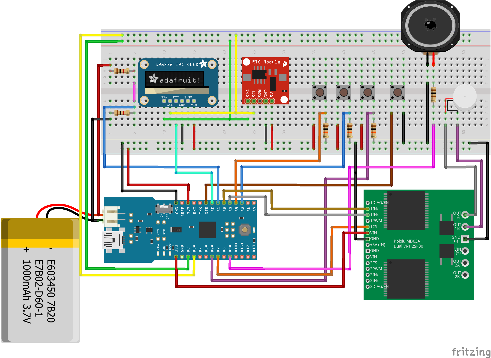

vibrate_alarm_clock
===================

An alarm clock with vibration and battery monitoring capabilities. During an alarm, it plays the Super Mario tune. Buttons available to set the alarm, turn off OLED and reset.
This device is meant for my friend's birthday gift.

I agree this is an epic mess but the space constraints left me no choice. Higher resolution photos are available in the "misc" directory.   

<b>Main Parts used:</b>  

1. Sparkfun Arduino Fio V3 (based on ATmega32U4 chip)  
2. Adafruit 1.3" 128x64 OLED set to I2C  
3. Chronodot v2.1 Real Time Clock (based on DS3231 temperature compensated RTC crystal)  
4. 4x button switches (1 switch as reset button)  
5. 3x 10k ohm resistors (for switches)  
6. 8 ohm thin speaker  
7. 100 ohm resistor (for speaker)  
8. 2x 1k ohm resistors (as voltage divider to measure battery voltage)
9. Pololu DRV8833 dual motor driver  
10. 10mm vibration motor
11. 1000mAh Lithium battery

Optional:  

1. 2x half-breadboard 
2. Translucent case  

This schematic only represents the logical connections I made. The physical connections differs due to space issues.   
Closest components used as Fritzing does not have them.  
1. MD030A as DRV8833 motor driver. (Pin D7 on the Arduino is connected to the sleep pin on the DRV8833.)  
2. 128x32 OLED as 128x64 OLED.  
3. Fio as Fio V3 (Fio's DTR Pin = Fio V3's RST Pin)  
4. RTC module as Chronodot

<b>Tips:</b>

1. Try to avoid using float variables in your Arduino code if you are tight on binary size. Use integer or long types for intermediate variables if you can.

2. Store unimportant data into flash memory to reduce SRAM usage.

<b>Stuff to note:</b>

1. It is possible to set a wrong date and time to the Chronodot. The Chronodot seems to just freeze there? I can check for everything except for the number of days in a month. The extra code to do this check is too much to put into the limited space of the Fio V3. So do be careful when setting the date component.  

2. Included is a subproject named vibrate_alarm_clock_test. This is meant to test all input and output functions.  
  a. On startup, the motor will briefly turn in one then the opposite direction.  
  b. Speaker will play a short tune.  
  c. Pressing first button will rotate motor in one direction until released.  
  d. Pressing second button will rotate motor in another direction until released.  
  e. Pressing both first and second buttons will play the short tune.  
  f. Third button will turn on/off the OLED.  
  g. Since the Arduino IDE only allows included header files to be in the same directory as the .ino, I had to duplicate the constants.h and pitches.h twice. Otherwise, they should be identical and shared between the sub and actual project.

3. The Arduino Fio V3 is quite a finicky thing. Occasionally it will repeatedly refuse to accept code uploads and just disconnect the USB connection. Unplugging/Replugging the USB cable even to another USB port does not work. Pressing the reset button three times before an upload seems to make it work again.

4. The OLED is set by default to use the SPI interface. If you want to use I2C, remember to solder the jumpers at the back. I used I2C to reduce the wire clutter since Chronodot already uses I2C.

5. The OLED library supplied by Adafruit requires at least 1K RAM on the Arduino to buffer the display. The Fio V3 only has 2K so that leaves 1K for other tasks. If you use too much RAM, the OLED may behave strangely like some parts not "rendered".  

6. Super Mario tune is contained in the tune.h header file. To save memory, the tune is stored into flash memory via PROGMEM to minimise SRAM usage.

7. I actually used 2x 220ohm resistors as I did not have a 100ohm resistor. I connected those in parallel to give approximately 100ohm for the speaker.

8. One is supposed to add a pull-up resistor for the I2C bus lines SCL and SDA if more than one device (OLED and Chronodot) uses them. I tried without the resistor and it seems to work fine. 

9. Fio V3's I2C lines are on D2(SDA) and D3(SCL).  

10. The alarm by default lasts for only 20 minutes before automatically turning off to conserve power. Customise this value MAX_ALARM_LENGTH if needed.  

<b>References and libraries:</b>  

1. Adafruit SSD1306 OLED library  
(https://github.com/adafruit/Adafruit_SSD1306)

2. AnyRTC RTClib    
(https://github.com/maniacbug/AnyRtc)

3. Rocket Scream Low Power library  
(http://www.rocketscream.com/blog/2011/07/04/lightweight-low-power-arduino-library/)

4. Get day of week from date.  
(http://stackoverflow.com/a/21235587)

5. Super Mario tune  
(http://www.linuxcircle.com/2013/03/31/playing-mario-bros-tune-with-arduino-and-piezo-buzzer/)

The MIT License (MIT) 
Copyright (c) 2014-2014 Yeo Kheng Meng 
